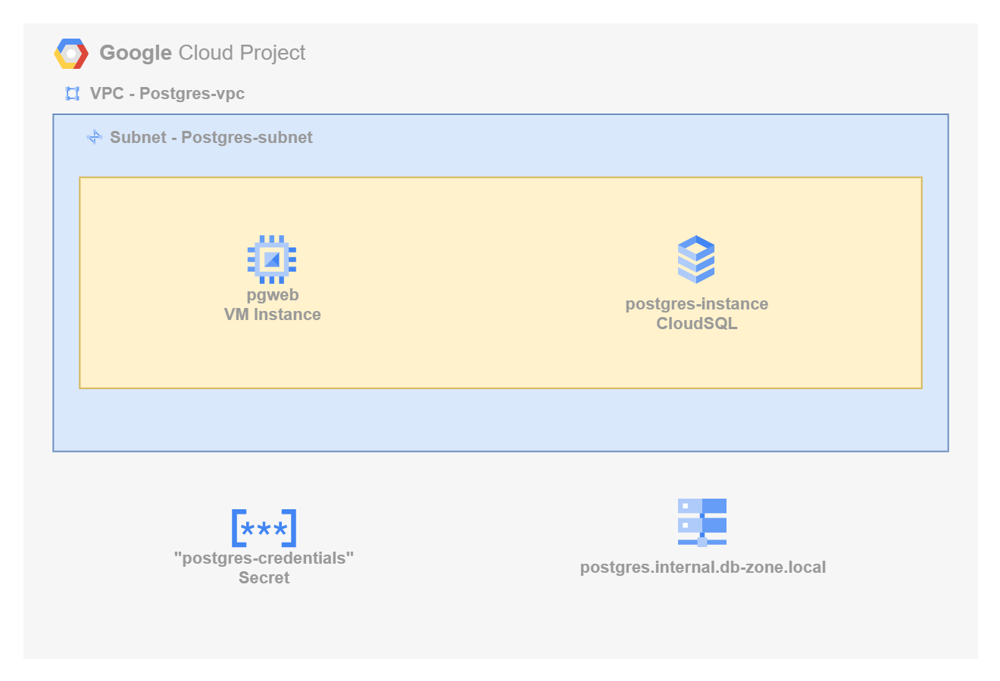
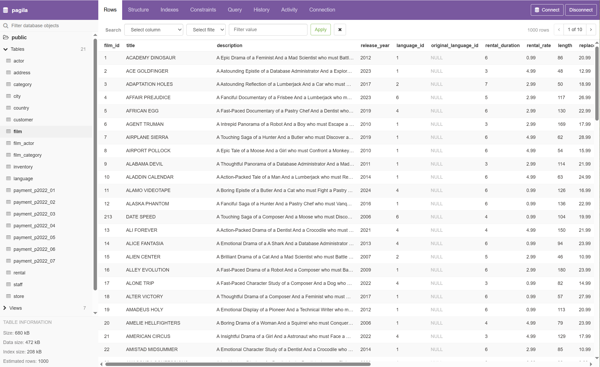

# Deploying PostgreSQL on Google Cloud Platform (GCP)

This project demonstrates how to deploy a secure, private PostgreSQL instance on Google Cloud using Terraform.

The deployment includes a Cloud SQL for PostgreSQL instance with public access disabled, integrated into a custom Virtual Private Cloud (VPC) and secured using private IP networking. Additionally, the project provisions a lightweight Ubuntu virtual machine that runs [pgweb](https://github.com/sosedoff/pgweb), a browser-based PostgreSQL client, allowing private, browser-accessible interaction with the database.

As part of the configuration, we deploy the [Pagila](https://www.postgresql.org/ftp/projects/pgFoundry/dbsamples/pagila/) sample dataset—a fictional DVD rental database—to showcase real-world querying and administration in a private cloud context. The solution is ideal for developers and teams looking to build secure, internal-facing applications without exposing the database to the public internet.



## What You'll Learn

- How to deploy a fully private PostgreSQL Cloud SQL instance on GCP using Terraform
- How to configure a custom VPC, subnet, and private IP for secure, internal connectivity
- How to provision a VM running `pgweb` for private browser-based database access
- Best practices for securing GCP-managed databases with private networking and infrastructure-as-code

## Prerequisites

* [A Google Cloud Account](https://console.cloud.google.com/)
* [Install gcloud CLI](https://cloud.google.com/sdk/docs/install) 
* [Install Latest Terraform](https://developer.hashicorp.com/terraform/install)

If this is your first time watching our content, we recommend starting with this video: [GCP + Terraform: Easy Setup](https://youtu.be/3spJpYX4f7I). It provides a step-by-step guide to properly configure Terraform, Packer, and the gcloud CLI.

## Download this Repository

```bash
git clone https://github.com/mamonaco1973/gcp-postgres.git
cd gcp-postgres
```

## Build the Code

Run [check_env.sh](check_env.sh) then run [apply.sh](apply.sh).

```bash
~/gcp-postgres$ ./apply.sh
NOTE: Validating that required commands are found in the PATH.
NOTE: gcloud is found in the current PATH.
NOTE: packer is found in the current PATH.
NOTE: terraform is found in the current PATH.
NOTE: jq is found in the current PATH.
NOTE: All required commands are available.
NOTE: Validating credentials.json and test the gcloud command
Activated service account credentials for: [terraform-build@debug-project-446221.iam.gserviceaccount.com]
Initializing the backend...
Initializing provider plugins...
- Reusing previous version of hashicorp/random from the dependency lock file
- Reusing previous version of hashicorp/google from the dependency lock file
- Reusing previous version of hashicorp/google-beta from the dependency lock file
- Reusing previous version of hashicorp/null from the dependency lock file
- Using previously-installed hashicorp/google v5.45.2
- Using previously-installed hashicorp/google-beta v4.85.0
- Using previously-installed hashicorp/null v3.2.4
- Using previously-installed hashicorp/random v3.7.2

Terraform has been successfully initialized!
[...]
```

## Build Results

After applying the Terraform scripts, the following GCP resources will be created:

### VPC & Subnet
- VPC: `postgres-vpc`
  - CIDR range: `10.0.0.0/23`
- Subnet: `postgres-subnet`
  - Region-based subnet (e.g., `us-central1`)
  - CIDR: `10.0.0.0/25`
- Firewall Rules:
  - Allow internal traffic
  - Allow HTTP and SSH access to the `pgweb` VM

### Private Networking
- Private Service Connection:
  - Enables private IP for Cloud SQL
  - Ensures all communication stays within the VPC

### Cloud SQL for PostgreSQL
- Database Version: PostgreSQL 15
- Instance: `postgres-instance`
  - Private IP only (no public access)
  - Preloaded with [Pagila sample database](https://www.postgresql.org/ftp/projects/pgFoundry/dbsamples/pagila/)
  - Credentials injected via Terraform

### Virtual Machine (pgweb)
- VM Name: `pgweb-vm`
  - Ubuntu-based instance
  - Deployed in the same subnet
  - Uses startup script to install and run `pgweb`
  - Connects privately to PostgreSQL via internal IP

## pgweb Demo

[pgweb](https://github.com/sosedoff/pgweb/blob/main/README.md) is a simple web-based and cross-platform PostgreSQL database explorer.



Query 1:
```sql
-- Select the film title and full actor name for each film
SELECT
    f.title AS film_title,
    a.first_name || ' ' || a.last_name AS actor_name
FROM
    film f
JOIN film_actor fa ON f.film_id = fa.film_id
JOIN actor a ON fa.actor_id = a.actor_id
ORDER BY f.title, actor_name
LIMIT 20;
```

Query 2:
```sql
-- Select film titles and a comma-separated list of all actors in each film
SELECT
    f.title,
    STRING_AGG(a.first_name || ' ' || a.last_name, ', ') AS actor_names
FROM
    film f
JOIN film_actor fa ON f.film_id = fa.film_id
JOIN actor a ON fa.actor_id = a.actor_id
GROUP BY f.title
ORDER BY f.title
LIMIT 20;
```
