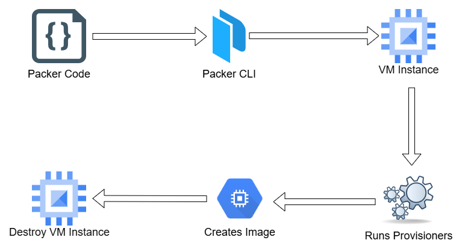
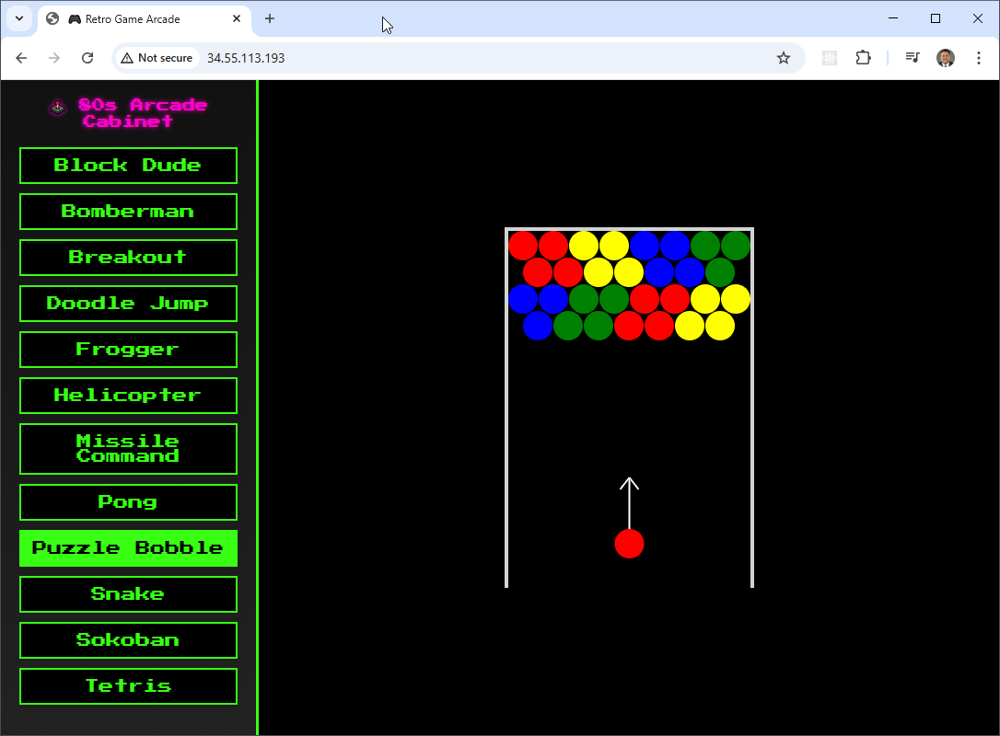
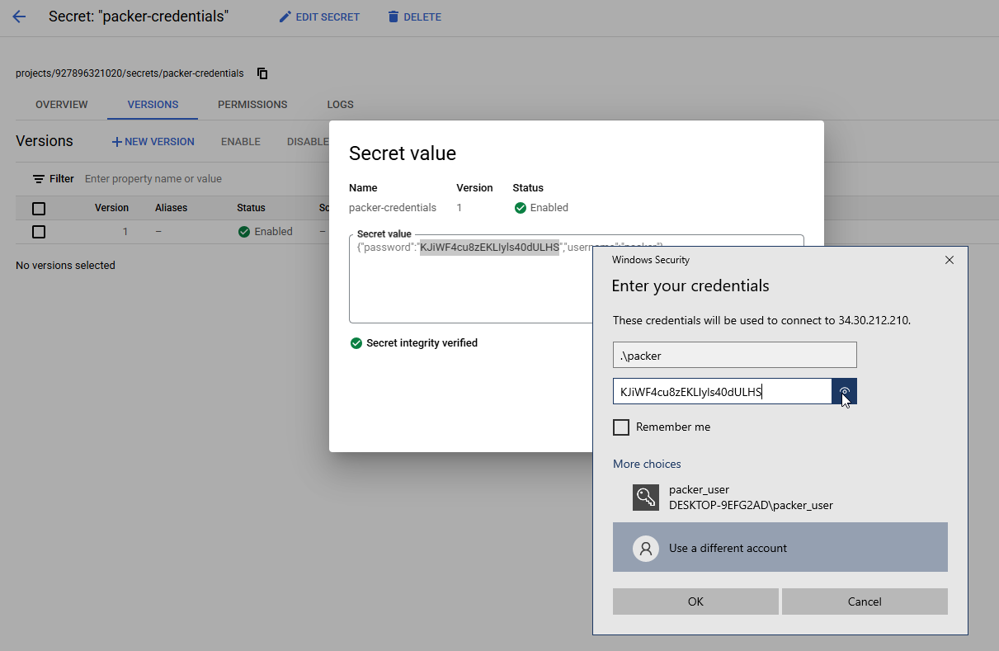
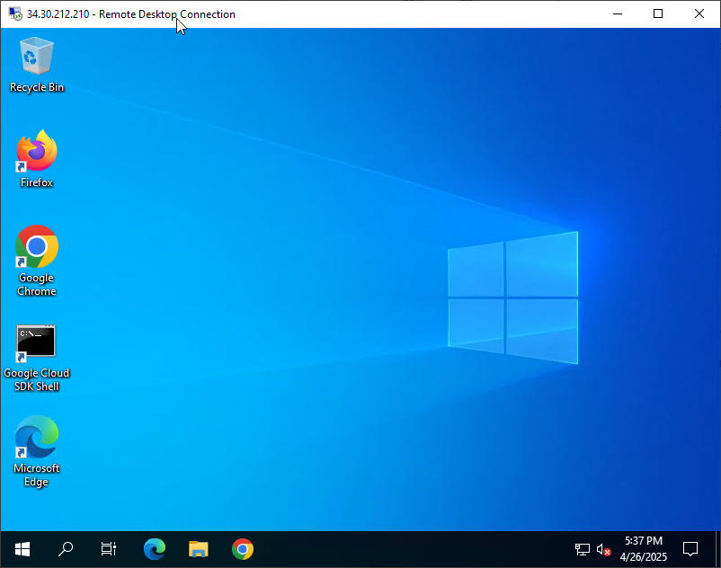

# Building VM Images with Packer in GCP

In the GCP solution, we use Packer to build and deploy custom **Linux** and **Windows** images to Compute Engine.

- For **Linux**, we create an Ubuntu-based image with Apache installed and deploy several retro-style HTML games. The source for the html games can be found at [https://gist.github.com/straker](https://gist.github.com/straker)
- For **Windows**, we install Chrome and Firefox, apply the **latest Windows Updates**, and execute **Sysprep** using native PowerShell commands.
- GCP **automatically installs WinRM**, but additional setup is required — we use a **metadata startup script** to set the WinRM password and configure authentication.
- We define a **custom firewall rule** to allow WinRM traffic (TCP 5986) so that the Windows instance is accessible for remote management.
- Image builds run within a custom **VPC and subnet** that are pre-provisioned to support isolated, controlled access.
- The Windows image supports **RDP** access using a local `packer` account, and the Linux image is tested via **HTTP** on port 80.

## Packer Workflow



## Prerequisites

* [A Google Cloud Account](https://console.cloud.google.com/)
* [Install gcloud CLI](https://cloud.google.com/sdk/docs/install) 
* [Install Latest Terraform](https://developer.hashicorp.com/terraform/install)
* [Install Latest Packer](https://developer.hashicorp.com/packer/install)

If this is your first time watching our content, we recommend starting with this video: [GCP + Terraform: Easy Setup](https://youtu.be/3spJpYX4f7I). It provides a step-by-step guide to properly configure Terraform, Packer, and the gcloud CLI.

## Download this Repository

```bash
git clone https://github.com/mamonaco1973/gcp-packer.git
cd gcp-packer
```

## Build the Code

Run [check_env](check_env.sh) and [api_setup](api_setup.sh) then run [apply](apply.sh).

```bash
~/gcp-packer$ ./apply.sh
NOTE: Validating that required commands are found in the PATH.
NOTE: gcloud is found in the current PATH.
NOTE: packer is found in the current PATH.
NOTE: terraform is found in the current PATH.
NOTE: jq is found in the current PATH.
NOTE: All required commands are available.
NOTE: Validating credentials.json and test the gcloud command
Activated service account credentials for: [terraform-build@debug-project-446221.iam.gserviceaccount.com]
Initializing the backend...
Initializing provider plugins...
- Finding latest version of hashicorp/google...
- Finding latest version of hashicorp/random...
- Installing hashicorp/google v6.32.0...
- Installed hashicorp/google v6.32.0 (signed by HashiCorp)
- Installing hashicorp/random v3.7.2...
- Installed hashicorp/random v3.7.2 (signed by HashiCorp)
Terraform has created a lock file .terraform.lock.hcl to record the provider
selections it made above. Include this file in your version control repository
so that Terraform can guarantee to make the same selections by default when
you run "terraform init" in the future.

Terraform has been successfully initialized!
[...]
```

### Build Process Overview

The build process is divided into three phases:

1. **Phase 1:** Configure the network and create the `packer` credentials stored in secrets manager.
2. **Phase 2:** Use packer to build the `games` Image and `desktop` Image using the network infrastructure from Phase 1. This part of the build takes the longest - at least 20 minutes.
3. **Phase 3:** Create the VM instances using the Images from Phase 2.

## Tour of Build Output in the GCP Console


## Test the Games Server

To test the games simply navigate to the public IP address of deployed instance in a web browser.



## Test the Desktop Server

To test the Desktop server you'll need to create an RDP session to the deployed instance. When prompted for credentials, use `packer` as the user id and then look up the password in the GCP console by viewing the `packer-credentials` secret.





